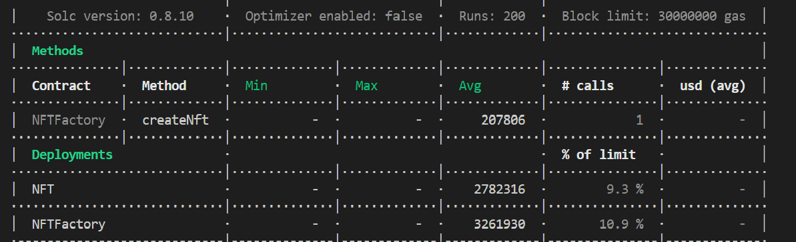

# Clone-examples
Basic contract on how to implement EIP 1167

Illustrates the advantage of using minimal proxy contracts(EIP 1167).
From the hardhat gas report we can see the difference in gas consumption while deploying nft contract as a minimal proxy contract vs normal contract deployment.

As we see while deploying nft contract as proxy contracts it cost 207806 avg gas. While deploying same contract as a normal contract it cost 2782316 avg gas.

This repo represents the basic example of minimal proxy(clone) contracts. Minimal proxy contract will reduce the deployment cost if same contract needs to be deployed multiple times. When implemntation contract is quite complex this approach will reduce large amoount of deployment cost.

 

